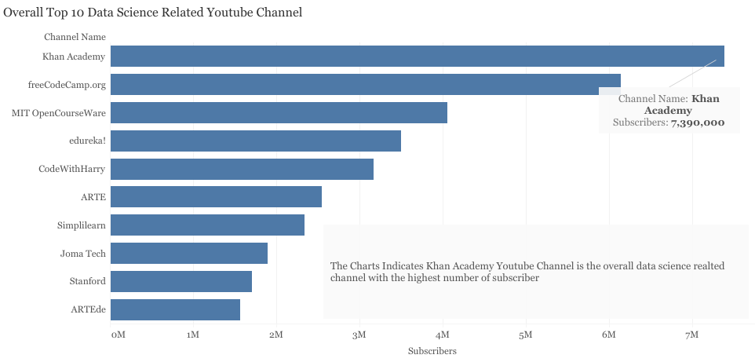
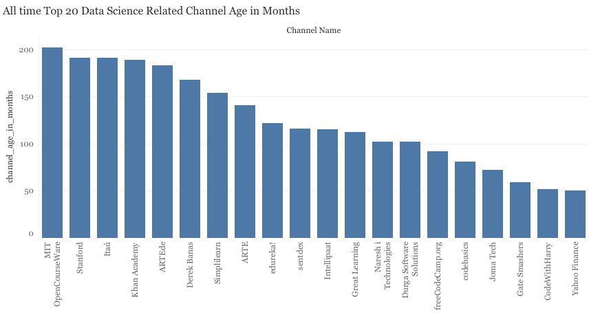
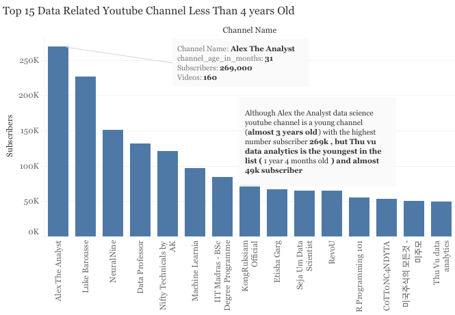
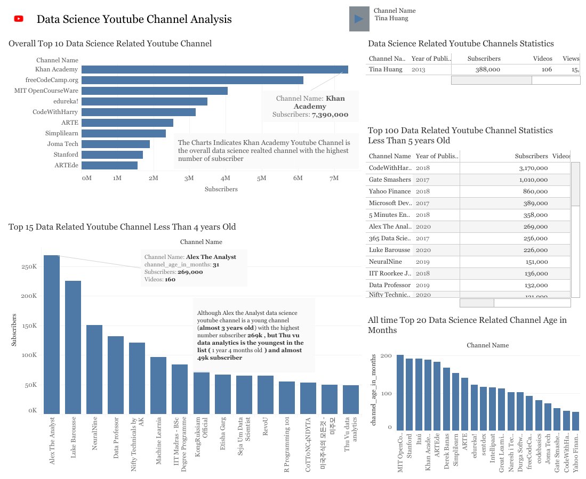

## Analysing Data Science Youtube Channels to accelerate my personal youtube channel

### Problem 
Low channel Subsribers

### Solution 
Know What the Viewers want to watch. 
As newbie data science youtuber need information on the top channels for data science and the channels for look up to for their content and get more ideas from their contents so as to create new and unique contents to attract new subscribers.

### How?
>- Get their data
>- Determine the overall top players
>- Determine the young channels i.e channels less than 4 years old with the most subscribers
>- Determing the rising star i.e the very young channels less 2 years having good number of subscribers
>- Check out the identified channels to see what they are doing and i'm not by subscribing to them and keep track of their contents 

### Data
Data was gathered from youtube using the google youtube Api v3 to request the for the data in json format 
[Click here for the data gahering Notebook](https://github.com/Ayobami6/Youtube-Analysis/blob/master/Youtube_data_analysis.ipynb ) 

### Analysis 
Analysis was the carried out on Tableau to obtain top insights on data science youtube channel 

### Findings and Conclusion 
#### First insight:
Discovered that khan Academy is the top youtube channel that also share data related contents

However, the channel seems to be too old but still worth checking out though

#### Second Insight:
From the Young category i.e less than 4 years old found out that Alex the Analyst is the Top, No doubt i'm a fan and this just confirmed i'm looking at and following the right channel. 

Moreso, Noticed Thu Vu data Analytics the youngest (1year 4 months old)in the list of the top 15 channels, i haven't really watching her contents and probably at the prime need to check it out and start following as its growing 

#### Recommendation

From the result, channels to look out for to know what the client might likely want to see are 
* Alex the Analyst
* Simplilearn
* Freecodecamp
* Luke Barouse
* NeuralNine
* Data Professor
* Tina Huang 
* Ken Jee 
* Thu vu data analytics 

#### Bonus insights 
CodewithHarry channel has rather high subscribers among peers of young channel with 3.17m subsriber, After being checked notice most of the channel video is in native language, Maybe i should start using language too haha!!!

#### Limitations 
Some channels might not be have use the keywords in any of their content, thus their data may not have been gathered. 

#### Growth 
More analysis can be carried out on the noted channels to get more information on the youtubers and see how they do things differently. 

Thank You..

